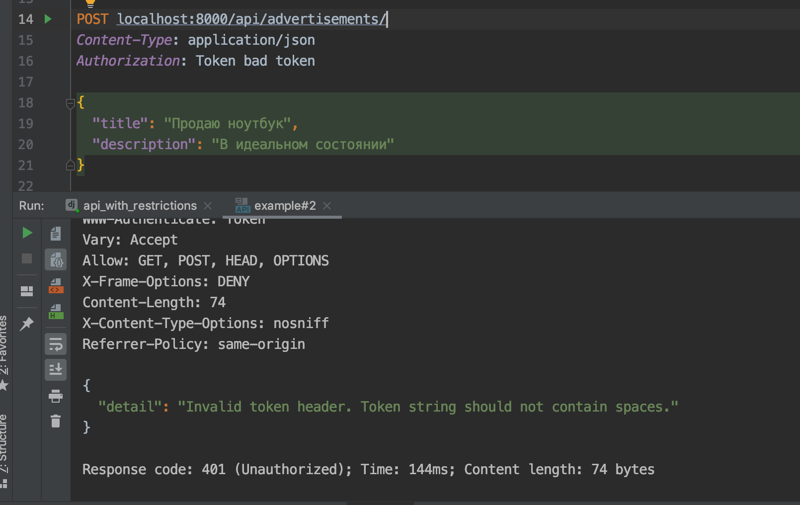

# Backend для приложения с объявлениями

## Описание

Необходимо реализовать бэкенд для мобильного приложения с объявлениями. Объявления можно создавать и просматривать. Есть возможность фильтровать объявления по дате и статусу.

Создавать могут только авторизованные пользователи. Для просмотра объявлений авторизация не нужна.

У объявления есть статусы: `OPEN`, `CLOSED`. Необходимо валидировать, что у пользователя не больше 10 открытых объявлений.

Обновлять и удалять объявление может только его автор.

Чтобы боты и злоумышленники не нагружали нашу систему, добавьте лимиты на запросы:

- для неавторизованных пользователей: 10 запросов в минуту;
- для авторизованных пользователей: 20 запросов в минуту.

### Права для админов

- Реализуйте функциональность для админов. Админы могут менять и удалять любые объявления.

### Избранные объявления

- Добавить возможность добавлять объявления в избранное. Автор объявления не может добавить своё объявление в избранное. Должна быть возможность фильтрации по избранным объявлениям. Например, пользователь хочет посмотреть все объявления, которые он добавил в избранное.

### Добавить статус `DRAFT`

- Добавить статус `DRAFT` — черновик. Пока объявление в черновике, оно показывается только автору объявления, другим пользователям оно недоступно.

## Реализация

**Примеры работы**

Фильтрация по дате:


Успешный запрос:


Неправильный токен:



## Документация по проекту

Для запуска проекта необходимо

Установить зависимости:

```bash
pip install -r requirements.txt
```

Выполнить команду:

```bash
python manage.py runserver
```

Протестировать запросы к API:
```bash
в файле requests-examples.http
```

Токены различных пользователей уже есть в файле. Токен админа:
```bash
4165dea908e9dfc2b1de058d50eab363dd2b83c2
```

Для того, чтобы завести новый токен для пользователя, проделайте следующие шаги:

- создайте пользователя через админку,
- также через админку заведите ему токен,
- этот токен используйте в запросах, передавая его в заголовках.

Данные для входа в админку:
```bash
Логин: admin
Пароль: admin
```

## Задачу выполнила
Евгения Псарева `epsareva77@gmail.com`
